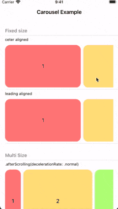
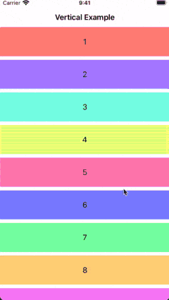

Snappable
===

[](https://github.com/hugehoge/Snappable/releases/latest)
[](https://cocoapods.org/pods/Snappable)
[](https://swiftpackageindex.com/hugehoge/Snappable)
[](https://swiftpackageindex.com/hugehoge/Snappable)

A set of SwiftUI custom modifiers to make the ScrollView snappable.

The goal of this library is to provide an easy way to implement Views such as carousels and slideshows.

## Demo

<p align="center">


</p>

## Requirements

- iOS 14.0+
- Swift 5.3+

### Note

**Snappable includes the copied code from [Introspect for SwiftUI](https://github.com/siteline/SwiftUI-Introspect) ([#17](https://github.com/hugehoge/Snappable/pull/17)) due to detect the behavior of scrolling from UIScrollView.**
**So this library would be fragile on iOS or SwiftUI updates.**

## Installation

### Swift Package Manager

```swift
.package(
  url: "https://github.com/hugehoge/Snappable.git",
  .upToNextMinor(from: "0.3.0")
)
```

### CocoaPods

```ruby
pod 'Snappable', '~> 0.3.0'
```

## Usage

### Basic

```swift
struct ContentView: View {
  @State private var items: [Item]

  var body: some View {
    ScrollView(.horiaontal) {
      LazyHStack {
        ForEach(items, id: \.self) { item in
          ItemView(item)
            .snapID(item)  // Step 1
        }
      }
    }
    .snappable()  // Step 2
  }
}
```

1. Added `.snapID(_:)` modifier to items in ScrollView
    - **`snapID` applies [.id(_:)](https://developer.apple.com/documentation/swiftui/view/id(_:)) modifier internally**
1. Added `.snappable(_:mode:)` modifier to ScrollView

### Options
#### Alignment

The snap anchor point can be set as an option.

```swift
.snappable(alignment: .leading)
```

Available alignment parameters are below:

- `.top`
- `.leading`
- `.center`
- `.trailing`
- `.bottom`

#### SnapMode

You can determine the snap timing after the end of the drag with following parameters.

- `.afterScrolling`
- `.immediately`

Both parameters are set together with scrolling deceleration rate.

```swift
.snappable(alignment: .center, mode: .afterScolling(decelerationRate: .fast))
```

```swift
.snappable(alignment: .center, mode: .immediately(decelerationRate: .normal, withFlick: false))
```
